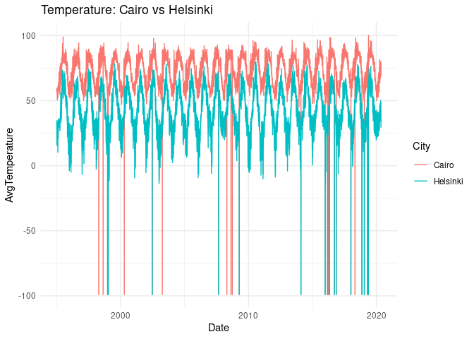
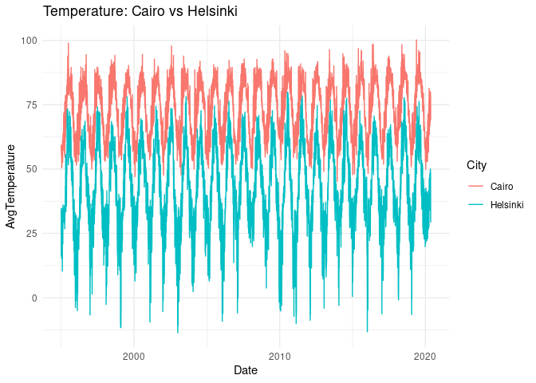
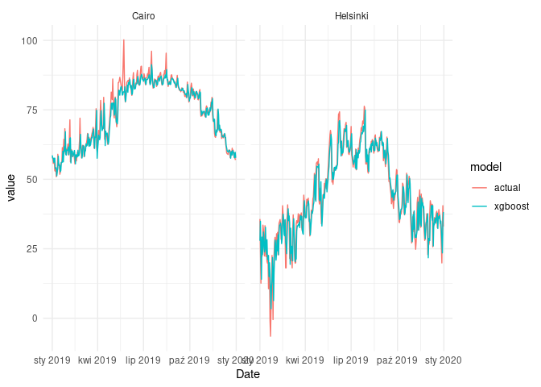
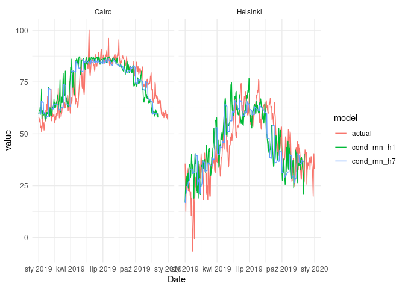
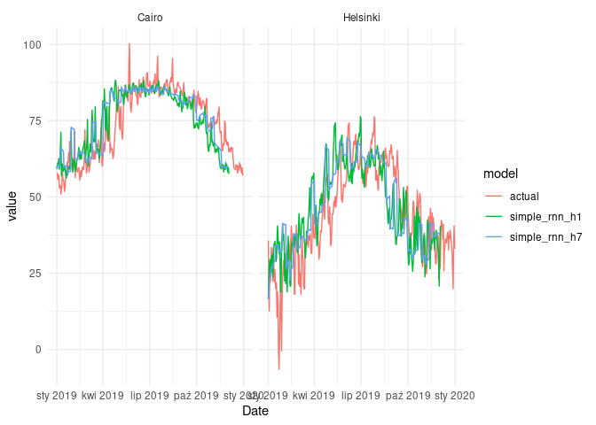
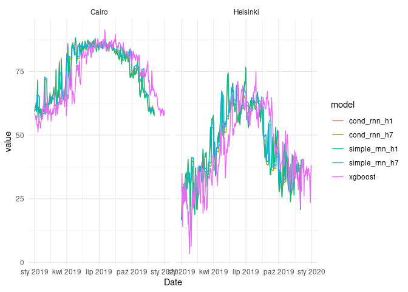

<a></a>

Conditional RNN is one of the possible solutions if we’d like to make
use of **static features** in time series forecasting. For example, we
want to build a model, which can handle multiple time series with many
different characteristics. It can be a model for demand forecasting for
multiple products or a unified model forecasting temperature in places
from different climate zones.

We have at least a couple of options to do so. They are described in
detail in the following [thread on
StackOverlow](https://datascience.stackexchange.com/questions/17099/adding-features-to-time-series-model-lstm/17139#17139).
According to the answers, the best way to add static features is to use
this values to produce an initial hidden state of the recurrent layer.
The proposed solution was [implemented as a Keras wrapper to recurrent
layers (in Python)](https://github.com/philipperemy/cond_rnn).

This post is a trial to implement conditional RNN in keras for R.

## Loading the data

We’ll use a piece of data from an experiment performed by the author of
the [aforementioned Keras
wrapper](https://github.com/philipperemy/cond_rnn/raw/master/examples/temperature/city_temperature.csv.zip).
We’re selecting two cities with extreme temperatures, e.g. **Cairo**
and **Helsinki**.
``` r
library(data.table, warn.conflicts = FALSE)
library(dplyr, warn.conflicts = FALSE)
library(lubridate)
library(ggplot2)
library(imputeTS
library(timetk)
library(rsample)
library(parsnip)

# url       <- "https://github.com/philipperemy/cond_rnn/raw/master/examples/temperature/city_temperature.csv.zip"
file_path <- "city_temperature.csv.zip"
csv_path  <- "city_temperature.csv"

# download.file(url, file_path)
# unzip(file_path)

city_temperature <- read.csv(csv_path)
setDT(city_temperature)

selected_cities <- 
  city_temperature[City %chin% c('Cairo', 'Helsinki')]

selected_cities[
  , Date := ymd(glue::glue("{Year}-{Month}-{Day}", .envir = .SD))
]

selected_cities <- 
  selected_cities[, .(City, Date, AvgTemperature)]
setorder(selected_cities, City, Date)
```


``` r
plt <- 
  ggplot(selected_cities) +
  geom_line(aes(Date, AvgTemperature, col = City)) + 
  theme_minimal() +
  ggtitle("Temperature: Cairo vs Helsinki")

plt
```



There is a couple of outliers and we can safely assume they simply
indicate lack of data. We’ll replace it with interpolated values.

Initially, I’ve chosen Oslo, but there were a few corrupted year
numbers:

```r
city_temperature[City == 'Oslo' & Year == 200]

##     Region Country State City Month Day Year AvgTemperature
##  1: Europe  Norway       Oslo    12   1  200            -99
##  2: Europe  Norway       Oslo    12   2  200            -99
##  3: Europe  Norway       Oslo    12   3  200            -99
##  4: Europe  Norway       Oslo    12   4  200            -99
##  5: Europe  Norway       Oslo    12   5  200            -99
##  6: Europe  Norway       Oslo    12   6  200            -99
##  7: Europe  Norway       Oslo    12   7  200            -99
##  8: Europe  Norway       Oslo    12   8  200            -99
##  9: Europe  Norway       Oslo    12   9  200            -99
## 10: Europe  Norway       Oslo    12  10  200            -99
## 11: Europe  Norway       Oslo    12  11  200            -99
## 12: Europe  Norway       Oslo    12  12  200            -99
## 13: Europe  Norway       Oslo    12  13  200            -99
## 14: Europe  Norway       Oslo    12  14  200            -99
## 15: Europe  Norway       Oslo    12  15  200            -99
## 16: Europe  Norway       Oslo    12  16  200            -99
## 17: Europe  Norway       Oslo    12  17  200            -99
## 18: Europe  Norway       Oslo    12  18  200            -99
## 19: Europe  Norway       Oslo    12  19  200            -99
## 20: Europe  Norway       Oslo    12  20  200            -99
## 21: Europe  Norway       Oslo    12  21  200            -99
## 22: Europe  Norway       Oslo    12  22  200            -99
## 23: Europe  Norway       Oslo    12  23  200            -99
## 24: Europe  Norway       Oslo    12  24  200            -99
## 25: Europe  Norway       Oslo    12  25  200            -99
## 26: Europe  Norway       Oslo    12  26  200            -99
## 27: Europe  Norway       Oslo    12  27  200            -99
## 28: Europe  Norway       Oslo    12  28  200            -99
## 29: Europe  Norway       Oslo    12  29  200            -99
## 30: Europe  Norway       Oslo    12  30  200            -99
## 31: Europe  Norway       Oslo    12  31  200            -99
##     Region Country State City Month Day Year AvgTemperature

# Cleaning the data
selected_cities[AvgTemperature == -99.0, AvgTemperature := NA]
selected_cities[, AvgTemperature := na_interpolation(AvgTemperature)]

plt <- 
  ggplot(selected_cities) +
  geom_line(aes(Date, AvgTemperature, col = City)) + 
  theme_minimal() +
  ggtitle("Temperature: Cairo vs Helsinki")

plt
# plotly::ggplotly(plt)
```



```r
library(tsibble, warn.conflicts = FALSE, quietly = TRUE)

duplicates(selected_cities, key = City, index = Date)

## # A tibble: 4 × 3
##   City     Date       AvgTemperature
##   <chr>    <date>              <dbl>
## 1 Cairo    2015-12-30           60.5
## 2 Cairo    2015-12-30           57.9
## 3 Helsinki 2015-12-30           26.6
## 4 Helsinki 2015-12-30           25.4

# Removing dupicates for 
selected_cities <- 
  selected_cities[, .(AvgTemperature = max(AvgTemperature)) , by = .(City, Date)]

train <- selected_cities[Date < as.Date('2019-01-01')]
test  <- selected_cities[
  Date >= as.Date('2019-01-01') & Date <= as.Date('2019-12-31')
]
```


## Baseline model - one xgboost model for both cities

As a baseline model, we’ll train a `xgboost` model using `parsnip` API
and `modeltime`. We create a `data.frame` of lagged variables to feed
the model. We use **28 lags** - the same value will be later used as a
length of input to the **recurrent neural netowrk** models. We also mix
the data belonging to different cities, so there are no separate
models for each city.

```r
library(modeltime)

lagged_selected_cities <- 
  selected_cities %>% 
  group_by(City) %>% 
  tk_augment_lags(AvgTemperature, .lags = 1:28) %>% 
  ungroup()

setDT(lagged_selected_cities)

train <- lagged_selected_cities[Date < as.Date('2019-01-01')]
test  <- lagged_selected_cities[
  Date >= as.Date('2019-01-01') & Date <= as.Date('2019-12-31')
]

lagged_variables <- glue::glue("AvgTemperature_lag{1:28}")
formula_rhs      <- paste0(lagged_variables, collapse = " + ")
model_formula    <- as.formula(
  glue::glue("AvgTemperature ~ {formula_rhs}")
)

model_xgboost <- 
  boost_tree(mode = "regression") %>% 
  set_engine("xgboost") %>% 
  fit(model_formula, data = train)

fcast <- 
  model_xgboost %>% 
  predict(test)

mdltime <- 
  modeltime_table(
    xgboost = model_xgboost
  )

fcast_cairo <- 
  mdltime %>% 
  modeltime_forecast(
    test[City == 'Cairo'], actual_data = test[City == 'Cairo']
  ) 

fcast_helsinki <- 
  mdltime %>% 
  modeltime_forecast(
    test[City == 'Helsinki'], actual_data = test[City == 'Helsinki']
  ) 

fcast_cairo <- 
  fcast_cairo %>% 
  mutate(name = 'Cairo')

fcast_helsinki <- 
  fcast_helsinki %>% 
  mutate(name = 'Helsinki')

fcast_xgboost <- 
  bind_rows(
    fcast_cairo, fcast_helsinki
  ) %>% 
  filter(.key == 'prediction') %>% 
  select(.index, .value, name) %>% 
  rename(Date = .index, value = .value) %>% 
  mutate(model = 'xgboost')
```

Let’s take a glance, how the models’ predictions look like.

```r
fcast_xgboost_cmp <- 
  bind_rows(
    fcast_xgboost,
    select(test, Date, name = City, value = AvgTemperature) %>% 
      mutate(model = 'actual')
  )

ggplot(fcast_xgboost_cmp) + 
  geom_line(aes(Date, value, col = model)) + 
  facet_wrap(~name) +
  theme_minimal()
```



As we can see, `xgboost` models fitted to the data quite well. However,
the task was relatively simple, because we only wanted to forecast one
timestep ahead.

## Preparing data for RNNs

We pass to the ‘main course’ - training recurrent neural networks.
First, we create a couple of auxiliary functions to create input
tensors:

-   **3-dimensional tensors** for input time series
-   **matrices** for outputs and static variables


```r
library(abind)

ndim <- function(x){
  length(dim(x))
}

shuffle <- function(...){

  objects     <- list(...)
  object_size <- dim(objects[[1]])[1]
  
  indices <- sample(object_size,  object_size)
  
  Map(\(x) if (ndim(x) == 2) x[indices, ] else x[indices, ,], objects)
}

prepare_output <- function(fcast, idx){

  idx_cairo    <- idx == 1
  idx_helsinki <- idx == 0
    
  fcast_cairo <- 
    fcast[idx_cairo, ] %>% 
    t() %>% 
    as.vector()
  
  fcast_helsinki <- 
    fcast[idx_helsinki, ] %>% 
    t() %>% 
    as.vector()
  
  fcast_df <- 
    data.table(
      Date = test$Date[1:length(fcast_cairo)],
      Cairo = fcast_cairo,
      Helsinki = fcast_helsinki
    ) %>% 
    tidyr::pivot_longer(c(Cairo, Helsinki))
  
    fcast_df
}

prepare_data <- function(data, timesteps, horizon, jump, 
                       sample_frac, targets = TRUE, .shuffle = TRUE){

  data_period_length <- max(data$Date) - min(data$Date)
  data_period_length <- as.numeric(data_period_length) + 1
  
  n <- data_period_length - timesteps - horizon + 1
  
  starts <- seq(1, n, jump)
  starts <- sample(starts, size = length(starts) * sample_frac)
  starts <- sort(starts)
  
  # Cairo
  data_cairo <- 
    data[City == 'Cairo', .(AvgTemperature)]
  
  x_data_cairo <- 
    purrr::map(
      starts, 
      \(i) array(data_cairo[i:i+timesteps-1, ]$AvgTemperature, c(1, timesteps, 1))
    )
  
  x_data_cairo        <- abind(x_data_cairo, along = 1)
  x_data_static_cairo <- matrix(1, dim(x_data_cairo)[1], 1) 
  
  y_data_cairo <- 
      purrr::map(
        starts, 
        \(i) array(data_cairo[(i+timesteps):(i+timesteps+horizon-1), ]$AvgTemperature, c(1, horizon))
      )
  y_data_cairo <- abind(y_data_cairo, along = 1)
  
  # Helsinki
  data_helsinki <- 
    data[City == 'Helsinki', .(AvgTemperature)]
  
  x_data_helsinki <- 
    purrr::map(
      starts, 
      \(i) array(data_helsinki[i:i+timesteps-1, ]$AvgTemperature, c(1, timesteps, 1))
    )
  
  x_data_helsinki        <- abind(x_data_helsinki, along = 1)
  x_data_static_helsinki <- matrix(0, dim(x_data_helsinki)[1], 1) 
  
  # Complete data
  x_data        <- abind(x_data_cairo, x_data_helsinki, along = 1)
  x_static_data <- abind(x_data_static_cairo, x_data_static_helsinki, along = 1) 
  
  right_order <- 
  
  if (targets) {
      y_data_helsinki <- 
      purrr::map(
        starts, 
        \(i) array(data_helsinki[(i+timesteps):(i+timesteps+horizon-1), ]$AvgTemperature, c(1, horizon))
      )
      
      y_data_helsinki <- abind(y_data_helsinki, along = 1)
      y               <- abind(y_data_cairo, y_data_helsinki, along = 1)
      
      if (.shuffle)
        return(shuffle(x_data, x_static_data, y))
      else
        return(list(x_data, x_static_data, y))
  } else {
    if (.shuffle)
      return(shuffle(x_data, x_static_data))
    else 
      return(list(x_data, x_static_data))
  }

}
```

Experiment configuration:

```r
TIMESTEPS        <- 28
HORIZON_1        <- 1
HORIZON_7        <- 7

DYNAMIC_FEATURES <- 1
STATIC_FEATURES  <- 1
RNN_UNITS        <- 32
VOCABULARY_SIZE  <- 2 # because we have two cities
```


Importing `keras`, we’re also loading multiple assignment operator from
`zeallot`, namely `%<-%`.

```r
library(keras)

JUMP        <- 1
SAMPLE_FRAC <- 0.5

# HORIZON = 1

# Training data
c(x_train_h1, x_static_train_h1, y_h1) %<-% 
  prepare_data(
    data        = train,
    timesteps   = TIMESTEPS,
    horizon     = HORIZON_1,
    jump        = HORIZON_1,
    sample_frac = SAMPLE_FRAC
  )

# Test data
c(x_test_h1, x_static_test_h1) %<-% 
  prepare_data(
    data        = test,
    timesteps   = TIMESTEPS,
    horizon     = HORIZON_1,
    jump        = HORIZON_1,
    sample_frac = 1,
    targets     = FALSE,
    .shuffle    = FALSE 
  )

# HORIZON = 7

# Training data
c(x_train_h7, x_static_train_h7, y_h7) %<-% 
  prepare_data(
    data        = train,
    timesteps   = TIMESTEPS,
    horizon     = HORIZON_7,
    jump        = 1,
    sample_frac = SAMPLE_FRAC
  )

# Test data
c(x_test_h7, x_static_test_h7) %<-% 
  prepare_data(
    data        = test,
    timesteps   = TIMESTEPS,
    horizon     = HORIZON_7,
    jump        = HORIZON_7,
    sample_frac = 1,
    targets     = FALSE,
    .shuffle    = FALSE 
  )
```

## Conditional RNN

The idea of **conditional RNN** is to initialize hidden states of the
recurrent layer using specially prepared values, which indicate a
specific type of the time series.

I let myself for some simplifications in these experiments, e.g.:
* data is not scaled
* validation data is not used to prevent overfitting


```r
experiment_conditional_rnn <- 
    function(timesteps, horizon, rnn_units, 
            vocabulary_size, dynamic_features, static_features,
            model, x_train, x_static_train, y, x_test, x_static_test){

  # Model
  ts_input     <- layer_input(shape = c(timesteps, dynamic_features))
  static_input <- layer_input(shape = static_features)
  
  embedding <- layer_embedding(input_dim = vocabulary_size, 
                               output_dim = rnn_units)(static_input)
  embedding <- layer_lambda(f = \(x) x[,1,])(embedding)
  
  rnn_layer <- 
    layer_gru(units = rnn_units, name = 'rnn')(ts_input, initial_state = embedding)
  
  # For LSTM layers we have to provide two hidden state values
  # rnn_layer <- 
  #  layer_gru(units = rnn_units, name = 'rnn')(ts_input, initial_state = list(embedding, embedding))
  
  final_layer <- layer_dense(units = horizon, activation = 'linear')(rnn_layer)
  
  # Compiling
  net <- 
    keras_model(
      inputs  = list(ts_input, static_input),
      outputs = list(final_layer) 
    ) %>%
    compile(
      optimizer = 'adam',
      loss      = 'mae'
    )
  
  # Training
  net %>% 
    fit(
      x = list(x_train, x_static_train),
      y = list(y),
      epochs = 50,
      batch_size = 32
    )

  # Forecasting
  fcast <- 
    net %>% 
    predict(list(x_test, x_static_test))
  

  fcast_df <- prepare_output(fcast, x_static_test)
  fcast_df$model <- model

  list(net, fcast_df)
}

# HORIZON = 1
c(net_cond_h1, fcast_cond_h1) %<-% 
  experiment_conditional_rnn(
    # Network
    timesteps        = TIMESTEPS,
    vocabulary_size  = VOCABULARY_SIZE,
    dynamic_features = DYNAMIC_FEATURES,
    static_features  = STATIC_FEATURES,
    horizon          = HORIZON_1,
    rnn_units        = RNN_UNITS,
    model            = 'cond_rnn_h1',
    # Data
    x_train          = x_train_h1,
    x_static_train   = x_static_train_h1,
    y                = y_h1,
    x_test           = x_test_h1,
    x_static_test    = x_static_test_h1
  )

## Loaded Tensorflow version 2.8.0

# HORIZON = 7
c(net_cond_h7, fcast_cond_h7) %<-% 
  experiment_conditional_rnn(
    # Network
    timesteps        = TIMESTEPS,
    vocabulary_size  = VOCABULARY_SIZE,
    dynamic_features = DYNAMIC_FEATURES,
    static_features  = STATIC_FEATURES,
    horizon          = HORIZON_7,
    rnn_units        = RNN_UNITS,
    model            = 'cond_rnn_h7',
    # Data
    x_train          = x_train_h7,
    x_static_train   = x_static_train_h7,
    y                = y_h7,
    x_test           = x_test_h7,
    x_static_test    = x_static_test_h7
  )

fcast_cond_cmp <- 
  bind_rows(
    fcast_cond_h1,
    fcast_cond_h7,
    select(test, Date, name = City, value = AvgTemperature) %>% 
      mutate(model = 'actual')
  )

ggplot(fcast_cond_cmp) + 
  geom_line(aes(Date, value, col = model)) + 
  facet_wrap(~name) +
  theme_minimal()
```



## Simple RNN

```r
experiment_simple_rnn <- 
  function(timesteps, horizon, rnn_units,
           model, x_train, y, x_test, x_static_test){
  
  # Network architecture
  ts_input  <- layer_input(shape = c(timesteps, 1))
  rnn_layer <- layer_gru(units = rnn_units, name = 'rnn')(ts_input)
  
  final_layer <- 
    layer_dense(units = horizon, activation = 'linear')(rnn_layer)
  
  # Compiling
  net <- 
    keras_model(
      inputs  = list(ts_input),
      outputs = list(final_layer) 
    ) %>%
    compile(
      optimizer = 'adam',
      loss      = 'mae'
    )
  
  # Training 
  net %>% 
    fit(
      x = list(x_train),
      y = list(y),
      epochs = 50,
      batch_size = 32
    )
  
  # Forecasting
  fcast <- 
    net %>% 
    predict(list(x_test))
  
  fcast_df <- prepare_output(fcast, x_static_test)
  fcast_df$model <- model

  list(net, fcast_df)     
}

# HORIZON = 1
c(net_simple_h1, fcast_simple_h1) %<-% 
  experiment_simple_rnn(
    # Network
    timesteps     = TIMESTEPS,
    horizon       = HORIZON_1,
    rnn_units     = 32,
    model         = 'simple_rnn_h1',
    # Data
    x_train       = x_train_h1,
    y             = y_h1,
    x_test        = x_test_h1,
    x_static_test = x_static_test_h1
  )

# HORIZON = 7
c(net_simple_h7, fcast_simple_h7) %<-% 
  experiment_simple_rnn(
    # Network
    timesteps     = TIMESTEPS,
    horizon       = HORIZON_7,
    rnn_units     = 32,
    model         = 'simple_rnn_h7',
    # Data
    x_train       = x_train_h7,
    y             = y_h7,
    x_test        = x_test_h7,
    x_static_test = x_static_test_h7
  )

fcast_simple_cmp <- 
  bind_rows(
    fcast_simple_h1,
    fcast_simple_h7,
    select(test, Date, name = City, value = AvgTemperature) %>% 
      mutate(model = 'actual')
  )

ggplot(fcast_simple_cmp) + 
  geom_line(aes(Date, value, col = model)) + 
  facet_wrap(~name) +
  theme_minimal()
```




## Summary

```r
library(yardstick)

fcast_df <- 
  bind_rows(
    fcast_xgboost,
    fcast_cond_h1,
    fcast_cond_h7,
    fcast_simple_h1,
    fcast_simple_h7
  )

fcast_df <- 
  fcast_df %>% 
  left_join(test %>% select(Date, City, AvgTemperature), 
            by = c('Date', 'name'='City'))

fcast_df %>% 
  group_by(model) %>% 
  summarise(mape = mape_vec(AvgTemperature, value)) %>% 
  gt::gt()
```

<div id="zpafsdmqom" style="overflow-x:auto;overflow-y:auto;width:auto;height:auto;">
<style>html {
  font-family: -apple-system, BlinkMacSystemFont, 'Segoe UI', Roboto, Oxygen, Ubuntu, Cantarell, 'Helvetica Neue', 'Fira Sans', 'Droid Sans', Arial, sans-serif;
}

#zpafsdmqom .gt_table {
  display: table;
  border-collapse: collapse;
  margin-left: auto;
  margin-right: auto;
  color: #333333;
  font-size: 16px;
  font-weight: normal;
  font-style: normal;
  background-color: #FFFFFF;
  width: auto;
  border-top-style: solid;
  border-top-width: 2px;
  border-top-color: #A8A8A8;
  border-right-style: none;
  border-right-width: 2px;
  border-right-color: #D3D3D3;
  border-bottom-style: solid;
  border-bottom-width: 2px;
  border-bottom-color: #A8A8A8;
  border-left-style: none;
  border-left-width: 2px;
  border-left-color: #D3D3D3;
}

#zpafsdmqom .gt_heading {
  background-color: #FFFFFF;
  text-align: center;
  border-bottom-color: #FFFFFF;
  border-left-style: none;
  border-left-width: 1px;
  border-left-color: #D3D3D3;
  border-right-style: none;
  border-right-width: 1px;
  border-right-color: #D3D3D3;
}

#zpafsdmqom .gt_title {
  color: #333333;
  font-size: 125%;
  font-weight: initial;
  padding-top: 4px;
  padding-bottom: 4px;
  padding-left: 5px;
  padding-right: 5px;
  border-bottom-color: #FFFFFF;
  border-bottom-width: 0;
}

#zpafsdmqom .gt_subtitle {
  color: #333333;
  font-size: 85%;
  font-weight: initial;
  padding-top: 0;
  padding-bottom: 6px;
  padding-left: 5px;
  padding-right: 5px;
  border-top-color: #FFFFFF;
  border-top-width: 0;
}

#zpafsdmqom .gt_bottom_border {
  border-bottom-style: solid;
  border-bottom-width: 2px;
  border-bottom-color: #D3D3D3;
}

#zpafsdmqom .gt_col_headings {
  border-top-style: solid;
  border-top-width: 2px;
  border-top-color: #D3D3D3;
  border-bottom-style: solid;
  border-bottom-width: 2px;
  border-bottom-color: #D3D3D3;
  border-left-style: none;
  border-left-width: 1px;
  border-left-color: #D3D3D3;
  border-right-style: none;
  border-right-width: 1px;
  border-right-color: #D3D3D3;
}

#zpafsdmqom .gt_col_heading {
  color: #333333;
  background-color: #FFFFFF;
  font-size: 100%;
  font-weight: normal;
  text-transform: inherit;
  border-left-style: none;
  border-left-width: 1px;
  border-left-color: #D3D3D3;
  border-right-style: none;
  border-right-width: 1px;
  border-right-color: #D3D3D3;
  vertical-align: bottom;
  padding-top: 5px;
  padding-bottom: 6px;
  padding-left: 5px;
  padding-right: 5px;
  overflow-x: hidden;
}

#zpafsdmqom .gt_column_spanner_outer {
  color: #333333;
  background-color: #FFFFFF;
  font-size: 100%;
  font-weight: normal;
  text-transform: inherit;
  padding-top: 0;
  padding-bottom: 0;
  padding-left: 4px;
  padding-right: 4px;
}

#zpafsdmqom .gt_column_spanner_outer:first-child {
  padding-left: 0;
}

#zpafsdmqom .gt_column_spanner_outer:last-child {
  padding-right: 0;
}

#zpafsdmqom .gt_column_spanner {
  border-bottom-style: solid;
  border-bottom-width: 2px;
  border-bottom-color: #D3D3D3;
  vertical-align: bottom;
  padding-top: 5px;
  padding-bottom: 5px;
  overflow-x: hidden;
  display: inline-block;
  width: 100%;
}

#zpafsdmqom .gt_group_heading {
  padding-top: 8px;
  padding-bottom: 8px;
  padding-left: 5px;
  padding-right: 5px;
  color: #333333;
  background-color: #FFFFFF;
  font-size: 100%;
  font-weight: initial;
  text-transform: inherit;
  border-top-style: solid;
  border-top-width: 2px;
  border-top-color: #D3D3D3;
  border-bottom-style: solid;
  border-bottom-width: 2px;
  border-bottom-color: #D3D3D3;
  border-left-style: none;
  border-left-width: 1px;
  border-left-color: #D3D3D3;
  border-right-style: none;
  border-right-width: 1px;
  border-right-color: #D3D3D3;
  vertical-align: middle;
}

#zpafsdmqom .gt_empty_group_heading {
  padding: 0.5px;
  color: #333333;
  background-color: #FFFFFF;
  font-size: 100%;
  font-weight: initial;
  border-top-style: solid;
  border-top-width: 2px;
  border-top-color: #D3D3D3;
  border-bottom-style: solid;
  border-bottom-width: 2px;
  border-bottom-color: #D3D3D3;
  vertical-align: middle;
}

#zpafsdmqom .gt_from_md > :first-child {
  margin-top: 0;
}

#zpafsdmqom .gt_from_md > :last-child {
  margin-bottom: 0;
}

#zpafsdmqom .gt_row {
  padding-top: 8px;
  padding-bottom: 8px;
  padding-left: 5px;
  padding-right: 5px;
  margin: 10px;
  border-top-style: solid;
  border-top-width: 1px;
  border-top-color: #D3D3D3;
  border-left-style: none;
  border-left-width: 1px;
  border-left-color: #D3D3D3;
  border-right-style: none;
  border-right-width: 1px;
  border-right-color: #D3D3D3;
  vertical-align: middle;
  overflow-x: hidden;
}

#zpafsdmqom .gt_stub {
  color: #333333;
  background-color: #FFFFFF;
  font-size: 100%;
  font-weight: initial;
  text-transform: inherit;
  border-right-style: solid;
  border-right-width: 2px;
  border-right-color: #D3D3D3;
  padding-left: 5px;
  padding-right: 5px;
}

#zpafsdmqom .gt_stub_row_group {
  color: #333333;
  background-color: #FFFFFF;
  font-size: 100%;
  font-weight: initial;
  text-transform: inherit;
  border-right-style: solid;
  border-right-width: 2px;
  border-right-color: #D3D3D3;
  padding-left: 5px;
  padding-right: 5px;
  vertical-align: top;
}

#zpafsdmqom .gt_row_group_first td {
  border-top-width: 2px;
}

#zpafsdmqom .gt_summary_row {
  color: #333333;
  background-color: #FFFFFF;
  text-transform: inherit;
  padding-top: 8px;
  padding-bottom: 8px;
  padding-left: 5px;
  padding-right: 5px;
}

#zpafsdmqom .gt_first_summary_row {
  border-top-style: solid;
  border-top-color: #D3D3D3;
}

#zpafsdmqom .gt_first_summary_row.thick {
  border-top-width: 2px;
}

#zpafsdmqom .gt_last_summary_row {
  padding-top: 8px;
  padding-bottom: 8px;
  padding-left: 5px;
  padding-right: 5px;
  border-bottom-style: solid;
  border-bottom-width: 2px;
  border-bottom-color: #D3D3D3;
}

#zpafsdmqom .gt_grand_summary_row {
  color: #333333;
  background-color: #FFFFFF;
  text-transform: inherit;
  padding-top: 8px;
  padding-bottom: 8px;
  padding-left: 5px;
  padding-right: 5px;
}

#zpafsdmqom .gt_first_grand_summary_row {
  padding-top: 8px;
  padding-bottom: 8px;
  padding-left: 5px;
  padding-right: 5px;
  border-top-style: double;
  border-top-width: 6px;
  border-top-color: #D3D3D3;
}

#zpafsdmqom .gt_striped {
  background-color: rgba(128, 128, 128, 0.05);
}

#zpafsdmqom .gt_table_body {
  border-top-style: solid;
  border-top-width: 2px;
  border-top-color: #D3D3D3;
  border-bottom-style: solid;
  border-bottom-width: 2px;
  border-bottom-color: #D3D3D3;
}

#zpafsdmqom .gt_footnotes {
  color: #333333;
  background-color: #FFFFFF;
  border-bottom-style: none;
  border-bottom-width: 2px;
  border-bottom-color: #D3D3D3;
  border-left-style: none;
  border-left-width: 2px;
  border-left-color: #D3D3D3;
  border-right-style: none;
  border-right-width: 2px;
  border-right-color: #D3D3D3;
}

#zpafsdmqom .gt_footnote {
  margin: 0px;
  font-size: 90%;
  padding-left: 4px;
  padding-right: 4px;
  padding-left: 5px;
  padding-right: 5px;
}

#zpafsdmqom .gt_sourcenotes {
  color: #333333;
  background-color: #FFFFFF;
  border-bottom-style: none;
  border-bottom-width: 2px;
  border-bottom-color: #D3D3D3;
  border-left-style: none;
  border-left-width: 2px;
  border-left-color: #D3D3D3;
  border-right-style: none;
  border-right-width: 2px;
  border-right-color: #D3D3D3;
}

#zpafsdmqom .gt_sourcenote {
  font-size: 90%;
  padding-top: 4px;
  padding-bottom: 4px;
  padding-left: 5px;
  padding-right: 5px;
}

#zpafsdmqom .gt_left {
  text-align: left;
}

#zpafsdmqom .gt_center {
  text-align: center;
}

#zpafsdmqom .gt_right {
  text-align: right;
  font-variant-numeric: tabular-nums;
}

#zpafsdmqom .gt_font_normal {
  font-weight: normal;
}

#zpafsdmqom .gt_font_bold {
  font-weight: bold;
}

#zpafsdmqom .gt_font_italic {
  font-style: italic;
}

#zpafsdmqom .gt_super {
  font-size: 65%;
}

#zpafsdmqom .gt_footnote_marks {
  font-style: italic;
  font-weight: normal;
  font-size: 75%;
  vertical-align: 0.4em;
}

#zpafsdmqom .gt_asterisk {
  font-size: 100%;
  vertical-align: 0;
}

#zpafsdmqom .gt_slash_mark {
  font-size: 0.7em;
  line-height: 0.7em;
  vertical-align: 0.15em;
}

#zpafsdmqom .gt_fraction_numerator {
  font-size: 0.6em;
  line-height: 0.6em;
  vertical-align: 0.45em;
}

#zpafsdmqom .gt_fraction_denominator {
  font-size: 0.6em;
  line-height: 0.6em;
  vertical-align: -0.05em;
}
</style>
<table class="gt_table">
  
  <thead class="gt_col_headings">
    <tr>
      <th class="gt_col_heading gt_columns_bottom_border gt_left" rowspan="1" colspan="1">model</th>
      <th class="gt_col_heading gt_columns_bottom_border gt_right" rowspan="1" colspan="1">mape</th>
    </tr>
  </thead>
  <tbody class="gt_table_body">
    <tr><td class="gt_row gt_left">cond_rnn_h1</td>
<td class="gt_row gt_right">34.32918</td></tr>
    <tr><td class="gt_row gt_left">cond_rnn_h7</td>
<td class="gt_row gt_right">31.92488</td></tr>
    <tr><td class="gt_row gt_left">simple_rnn_h1</td>
<td class="gt_row gt_right">34.44923</td></tr>
    <tr><td class="gt_row gt_left">simple_rnn_h7</td>
<td class="gt_row gt_right">32.86985</td></tr>
    <tr><td class="gt_row gt_left">xgboost</td>
<td class="gt_row gt_right">14.82363</td></tr>
  </tbody>
  
  
</table>
</div>

```r
plt <- 
  ggplot(fcast_df) + 
  geom_line(aes(Date, value, col = model)) + 
  theme_minimal() +
  facet_wrap(~name)

plt
```



## Conclusions

As we can see, there is technically no difference in terms of MAPE, when
we are comparing results of **simple\_rnn\_h1** and **cond\_rnn\_h1**.
When it comes to the RNN models with 7-day horizon, the diffrences are
also negligible.

Our baseline model beats both simple and conditional RNN models. However, bear
in mind that 1-timestep horizon is not a most realistic use case in most
problems.
